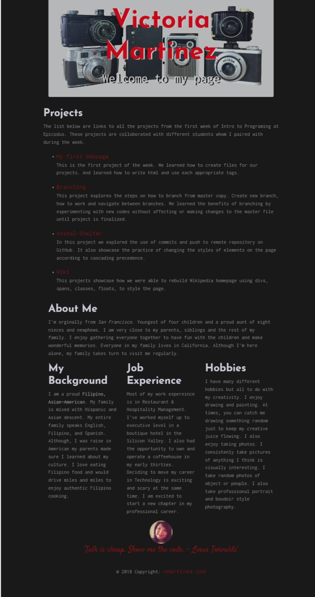

# _Portfolio Landing Page_

#### _Welcome to my Page, October 12, 2018_

#### By _**Victoria Martinez**_

## Description

_A brief personal and professional information about Victoria and a list of completed projects during the first week at Epicodus._

_Following objectives:

_The following HTML tags are all used:_
_p, h, ul, ol, li, em, strong, a, img, div, span_
_Bootstrap classes are used to style the page. This means explicitly using classes mentioned on this page, not just linking in the Bootstrap stylesheet._
_Project includes a custom-made stylesheet that uses typography styles, cascading, the box model, and floats. *Code is clean, well-refactored, and easy-to-read. This includes correct indendation, spacing, and including only necessary comments and debugging tools._
_Commits are made regularly with clear messages that finish the phrase "It will…"_
## Preview of project

## Setup/Installation Requirements

* _Turn on computer_
* _Clone project on github: https://github.com/vmartinezlive/Portfolio.git
* _Open file on terminal 
* _Open HTML on a browser of your choice_

## Known Bugs

_There is no known bugs_

## Support and contact details

_Contact: Victoria Martinez by emailing to: vmartinez72@live.com_

## Technologies Used

_Computer, HTML 5, BootstrapCDN, GitHub_

### License

Copyright (c) 2018 **_Victoria Martinez_**
